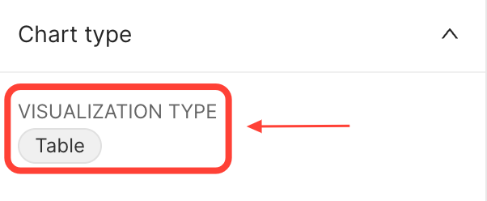
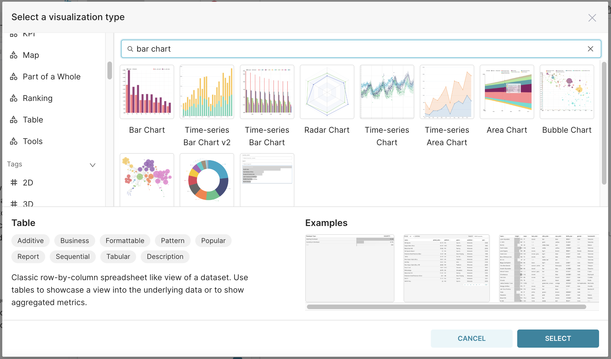
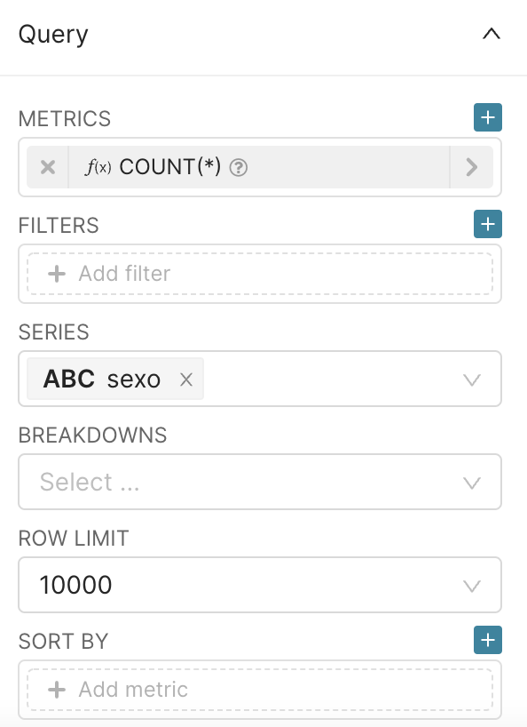
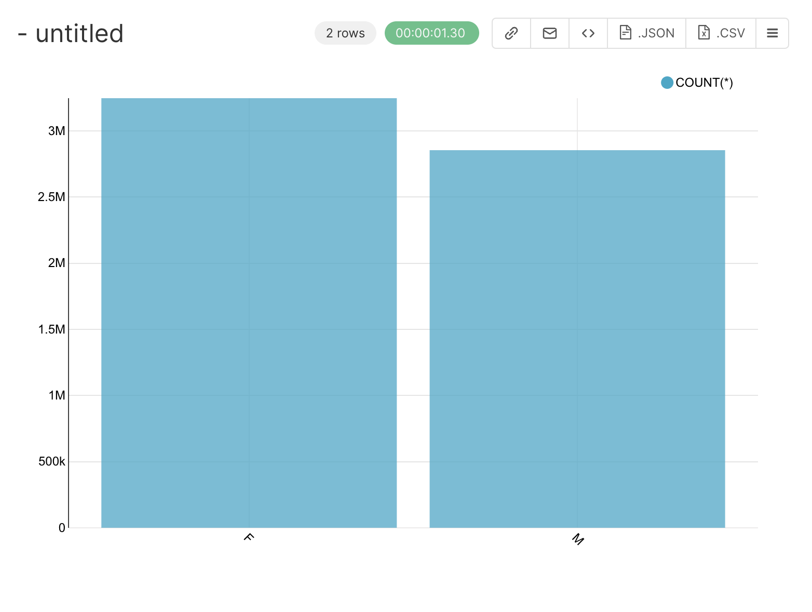
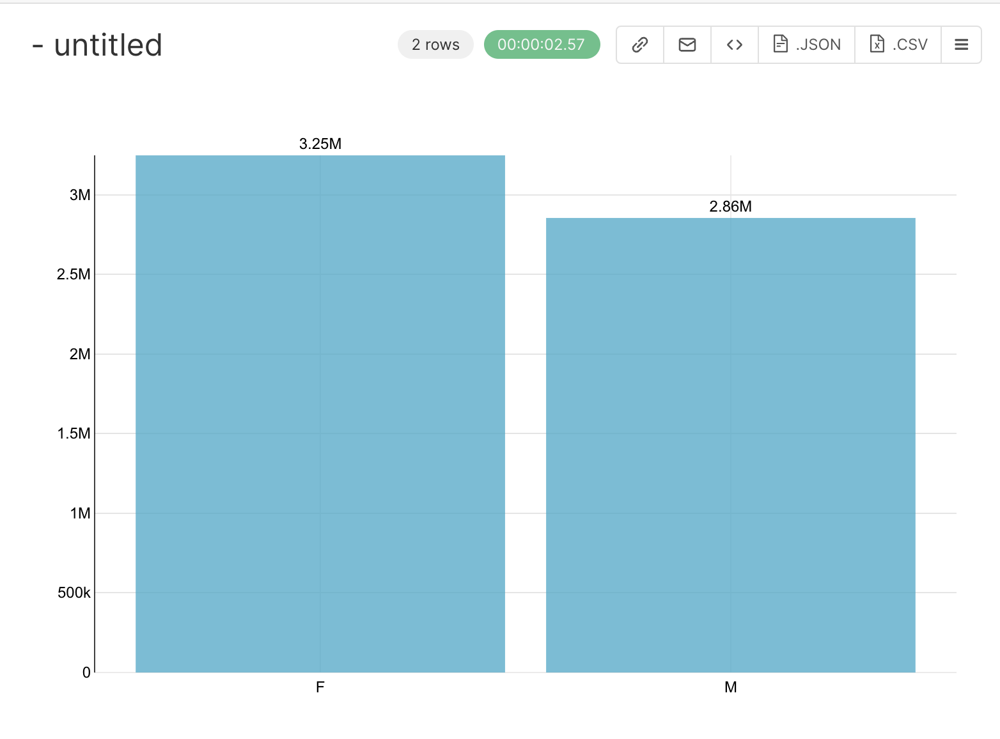

## Bar Chart

The bar chart can be used to visualize the count of unique values in a column. Let's use the `positive_cases_covid_d` dataset. We will plot the count of the unique values in the column `sexo`. 

To do this, open the `positive_cases_covid_d` dataset and click on the `Table` value to change the VISUALISATION TYPE:

{width=300px}

In the window that will open, type `bar chart`:

{width=750px}

Click on the bar chart and on the `SELECT` button. 

So, in the SERIES field, select the columns that we want to plot the values, in our case `sexo`, and in the METRICS count the lines aggregated by the values in SERIES using the metric `COUNT(*)`, to count all the lines returned. 

So, your final query configuration is: 

{width=300px}

After config the query, type `RUN QUERY` an the following result will be displayed in your screen:

{width=300px}

You can improve your plot by going to the CUSTOMIZE tab and ticking the BAR VALUES field and selecting `flat` in X TICK LAYOUT. Applying this configurations your result should be: 

{width=300px}

You also can change the color of your bars in the `COLOR SCHEME` (in the CUSTOMIZE tab) and apply filters in the FILTER section (in the QUERY section) to count the values in specific conditions. 

It is now time to :

1.  Specify a title for the chart, for instance `Total number of COVID-19 cases by sex`,
2.  Save it, by clicking on `+SAVE` button in the middle panel.

