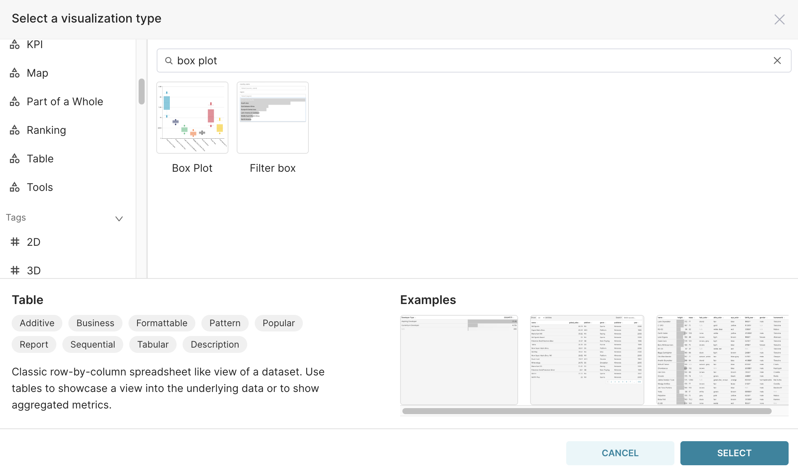
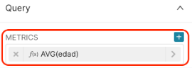
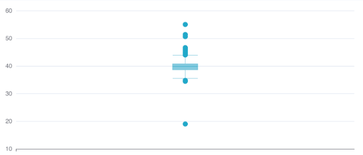
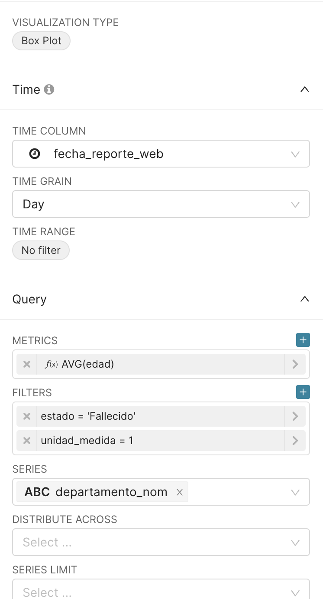
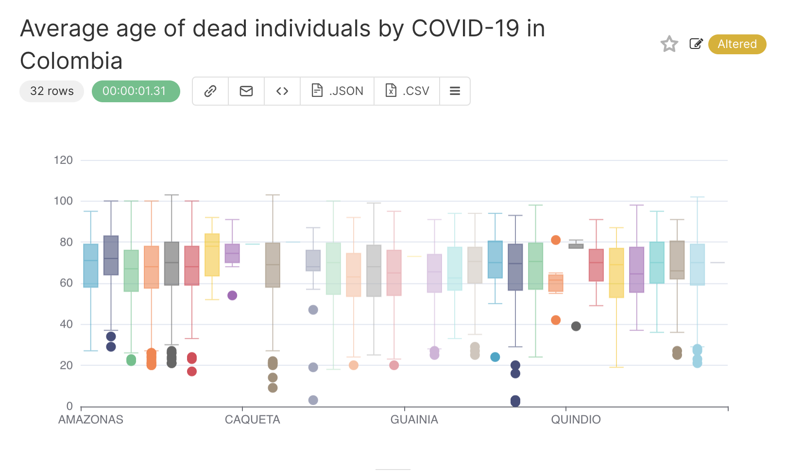
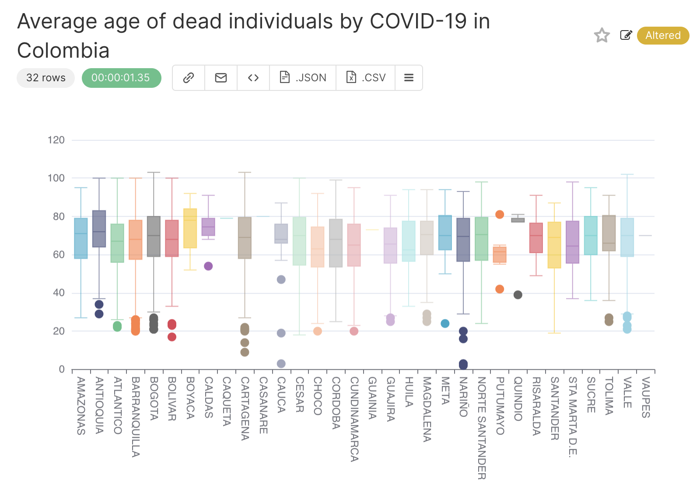
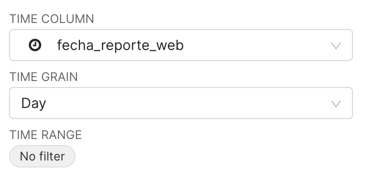

## Boxplot

The boxplots can be used to summarise the statistics of the values in a column. Using the `positive_cases_covid_d` dataset, let’s plot a histogram of the age of dead individuals. 

In this case, we will use the columns:

1. `edad` that refers to the age of the individual, 
2. `unidad_medida` to ensure that the value in `edad` represents years, and
3. `estado` to filter by the `Fallecido` (dead individuals).

To do this, open the `positive_cases_covid_d` dataset and click on the `Table` value to change the VISUALISATION TYPE:

{width=300px}

In the window that will open, type `box plot`:

{width=750px}

Click on the Box Plot and on the `SELECT` button.

For this chart, the METRICS field is mandatory. As we are interested in the age distribution, let’s start by setting the METRICS field to `AVG(edad)` in the Query section.

{width=300px}

And `RUN QUERY`. You should then get the following result, with only one box plot representing all age values in our dataset:

{width=500px}

::: key-point 
By default, the temporal column defined in TIME COLUMN and the TIME GRAIN are used to compute the value in METRICS. 
:::

In the result above, it means that :

1. all patients’ records were first grouped by `Day` based on the `fecha_reporte_web`column, then
2. the average ages (METRICS = `AVG(edad)`) by day were computed, and eventually 
3. the distribution of these average ages was plotted 

::: practice
To convince yourself about the explanation above, change the operator in the METRICS field from AVG to SUM, and see how it impacts the plotted distribution.
:::

Now, to see the distribution of the age of individuals, without prior aggregation by time,  we will fill the field DISTRIBUTE ACROSS with the `id_de_caso` column, representing the unique case ID of each record in our dataset . This will ensure that the box plot will use the age of each individual patient.

As a consequence of using DISTRIBUTE ACROSS = `id_de_caso`, selecting the AGGREGATE operator in METRICS to be SUM or AVG will not change the result distribution. Let's then keep METRICS as `AVG(edad)`. 

To get the age in years only for the dead individuals, let’s apply the two filters presented below:

{width=300px}{width=300px}

In the `SERIES` field, we will select the column with unique values to be shown along the X axis. For each unique value in this column, a box plot will be computed.

To get one box plot for each department in Colombia, let’s set SERIES to the column `departamento_nom`. So, your final query configuration is the following:

 

{width=300px}

After clicking on the `RUN QUERY` button, this will be the received result:

{width=500px}

To see the name of the `departamento_nom` associated with each box plot, we can rotate the X axis labels. To do this, go to the CUSTOMISE tab:

{width=500px}

and change the X TICK LAYOUT field to `90º`:

![]images//box_x_tick.png){width=300px}

and that’s the result:

{width=500px}

If you hover the mouse over a box plot, you get the information about the quartiles, observation, and outliers:

{width=500px}

It is now time to :

1.  Specify a title for the chart, for instance `Age of dead individuals by COVID-19 in Colombia`,
2.  Save it, by clicking on `+SAVE` button in the middle pane.

You can also change the time range considered in the region below:

{width=300px}

And in the field below, you can change the type of box plot: 

{width=300px}

By default, it uses `Tukey`, where the min and max values are at most 1.5 times the IQR (interquartile range) from the first quartile (25 percentile) and third quartile (75 percentile), respectively. The other available options are:

* `Min/max (no outliers)`;
* `2/98 percentiles`;
* `9/91 percentiles`.
