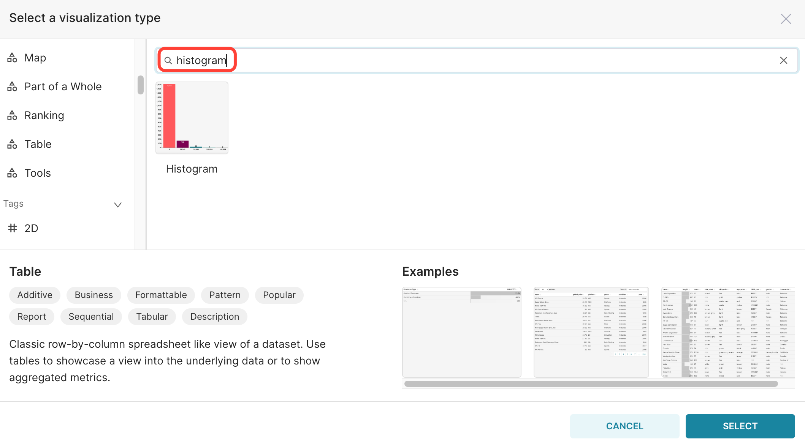
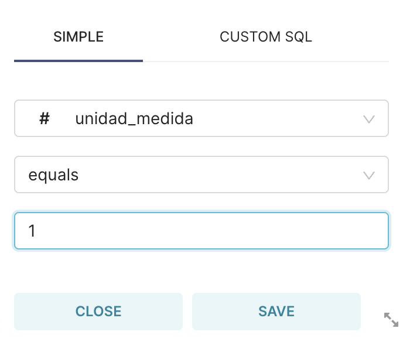
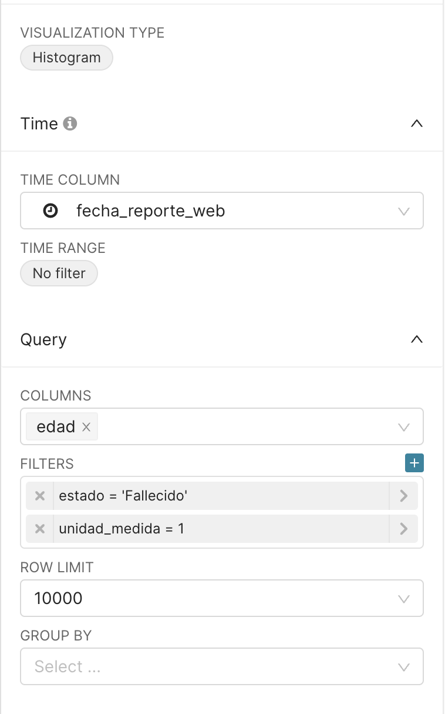
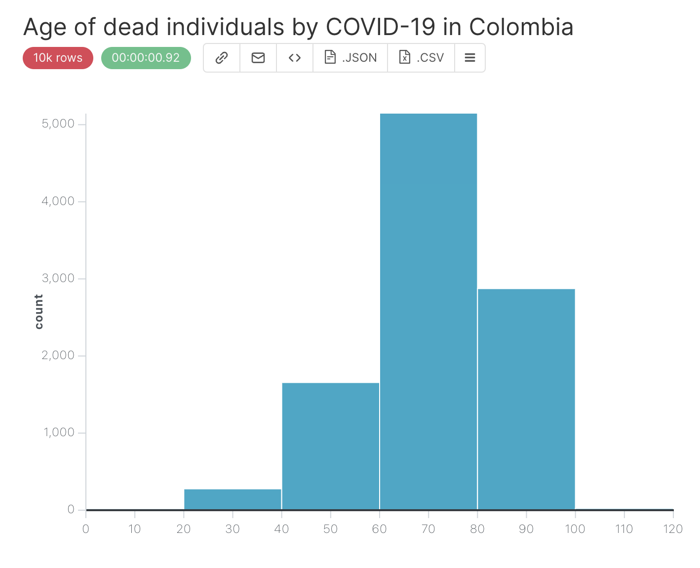
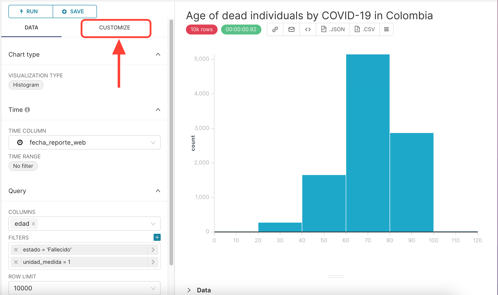
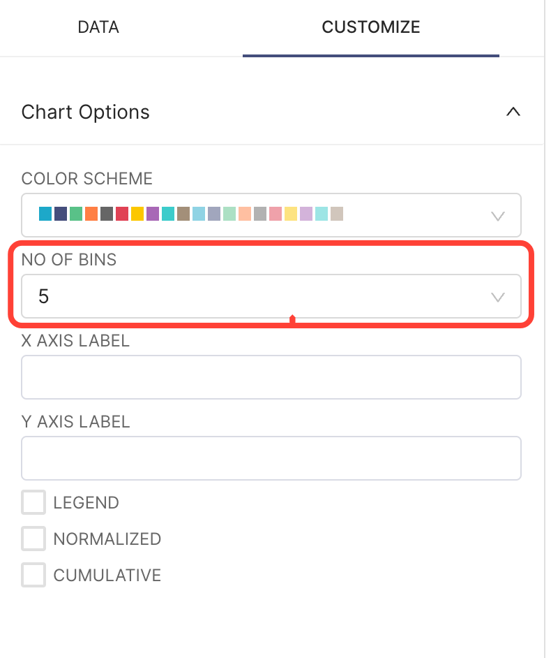
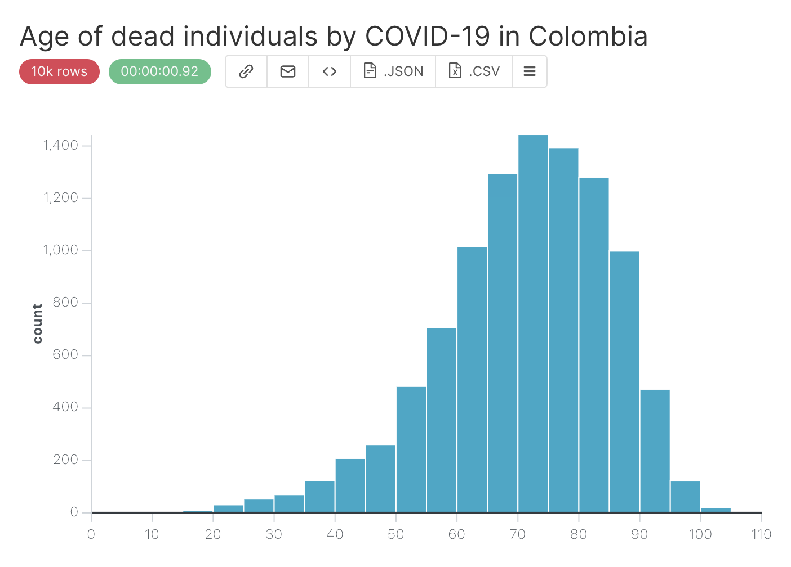
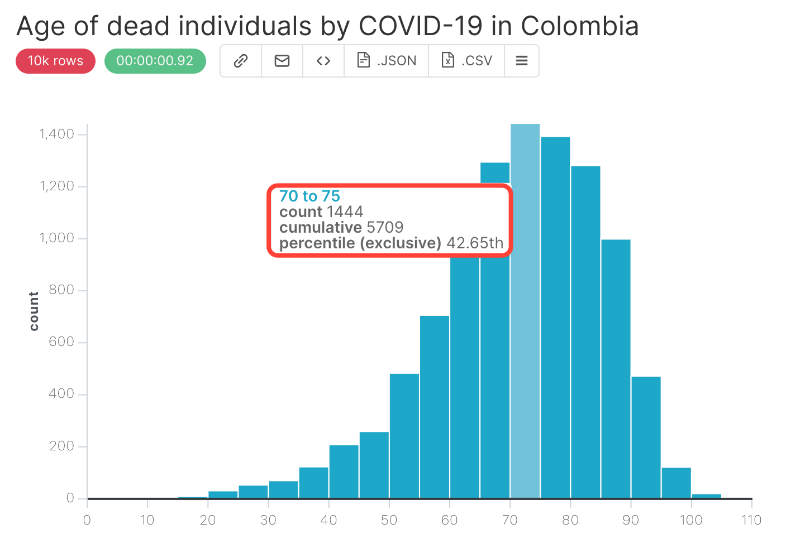

## Histogram 

The histogram can be used to provide the distribution of our data. Using the `positive_cases_covid_d` dataset, let’s plot a histogram of the age of dead individuals. 

In this case, we will use the columns:

1. `edad` that refers to the age of the individual, 
2. `unidad_medida` to ensure that the value in `edad` represents years, and
3. `estado` to filter by the `Fallecido` (dead individuals).

To do this, open the `positive_cases_covid_d` dataset and click on the `Table` value to change the VISUALISATION TYPE:

{width=300px}

In the window that will open, type `histogram`:

{width=750px}

Click on the histogram and on the `SELECT` button. 

In the Explore Page, select the column `edad` in the COLUMNS field and apply the two filters presented below:

{width=300px}{width=300px}

So, your final query configuration is: 

{width=300px}

After clicking on the `RUN QUERY` button, this will be the displayed result: 

{width=500px}

To change the number of bins in the histogram, go to the CUSTOMIZE tab: 

{width=500px}

and change the NO OF BINS field:

{width=300px}

After setting `NO OF BINS` to 20, you will get the result below:

{width=500px}

If you hover the mouse over the bars, you get the information about what range of the `edad` (age) the bar represents, what is the exact count, cumulative, and percentile that this bar represents:

{width=500px}

It is now time to :

1.  Specify a title for the chart, for instance `Age of dead individuals by COVID-19 in Colombia`,
2.  Save it, by clicking on `+SAVE` button in the middle panel.
