## Time Evolution - Line Chart

### Create a line chart

Suppose we are interested in following the evolution of weekly hospitalisations in Switzerland over the last 2 years, and would like to create a new chart for that, using the `switzerland.foph_hosp_d` dataset.

Let's go back to the **Charts** page, and click on the `+CHART` button in the upper right corner of the page to create a new chart.

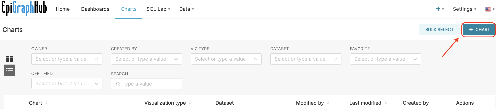{width="750px"}

The page named **Create a new chart** opens. You must do two things here:

1.  CHOOSE A DATASET, and
2.  CHOOSE A CHART TYPE.

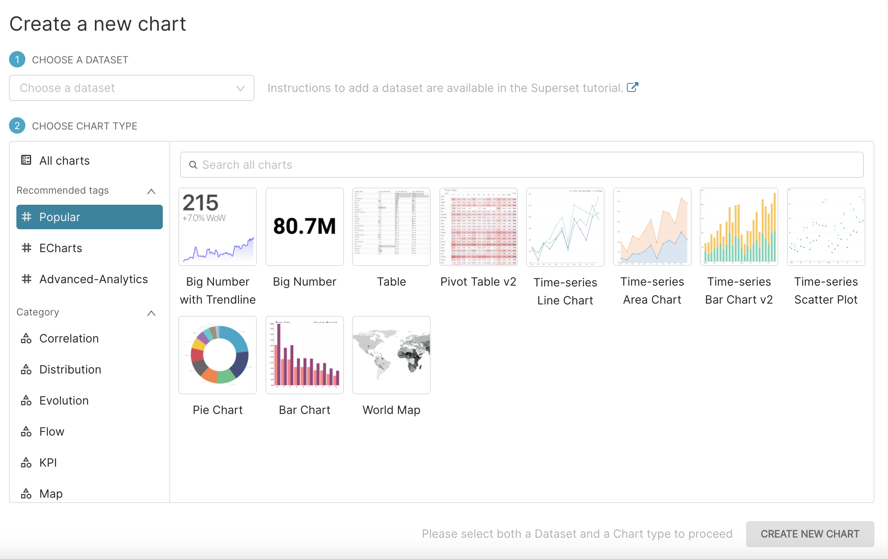{width="750px"}

In the field CHOOSE A DATASET, type or select from the drop-down list again the `foph_hosp_d` dataset.

In the CHOOSE CHART section, different sub-sections are available: **Recommended tags**, **Category**, and **Tags**.

In the **Category** sub-section, select the **Evolution** category. A number of corresponding charts will appear on the right panel. Let's click on the first one and select the: `Line Chart`. It is the classic chart that visualised how metrics change over time.

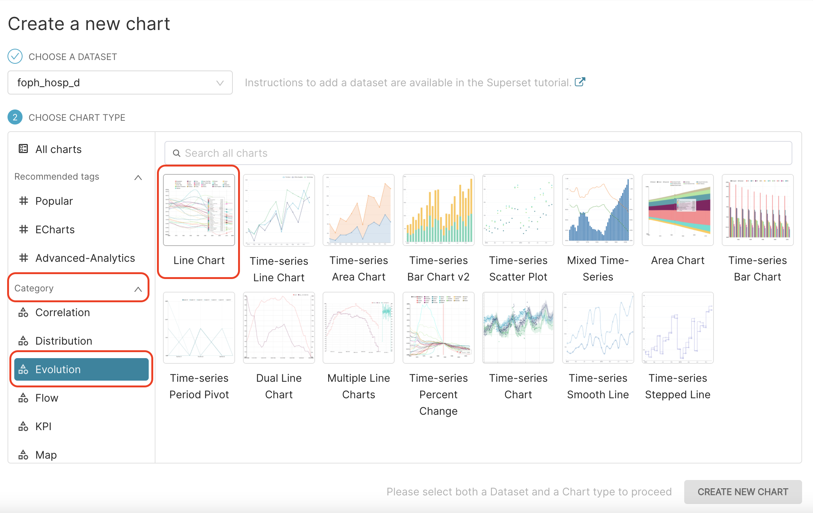{width="750px"}

We can then click on `CREATE NEW CHART` button in the bottom.

When you do so, a new Chart page opens, with pre-filled **Dataset** and **Chart type** fields.

You can see as well that for this type of chart, some parameters are **mandatory**. It is the case here for the METRICS field in the Query section. That is why it is colored in red, and annotated with an exclamation mark (**!**). Indeed, for line charts, METRICS field cannot be empty and one or many several metrics must be selected to be displayed.

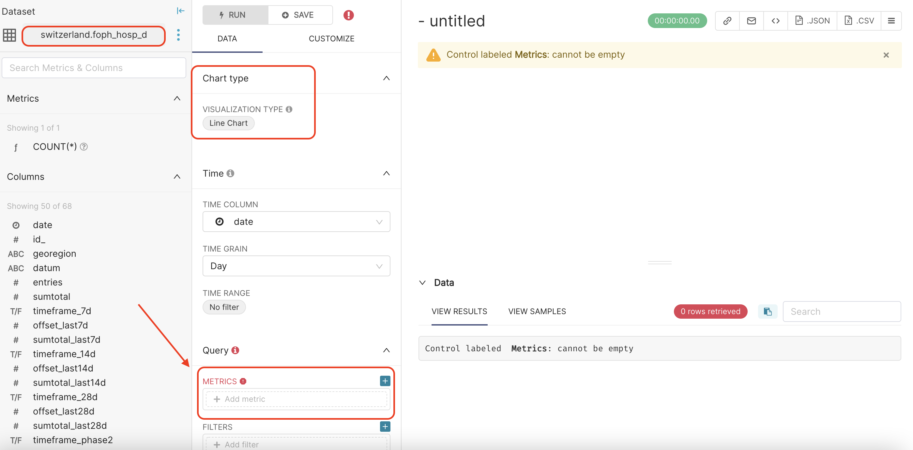{width="750px"}

### Metrics and Aggregation

As at least one METRIC is mandatory, let's click on `+ Add metric` in the METRICS field. A pop-up window appears. When we select the `SIMPLE` menu, we are requested to fill the COLUMN to be displayed and how we would like to AGGREGATE it.

As we have daily new hospitalisations data in our dataset and we are interested visualising weekly hospitalisations, we will set COLUMN to `entries`, and AGGREGATE to `SUM`, since the number of hospitalisations (entries) per week is the SUM of the daily hospitalisation during that week :)

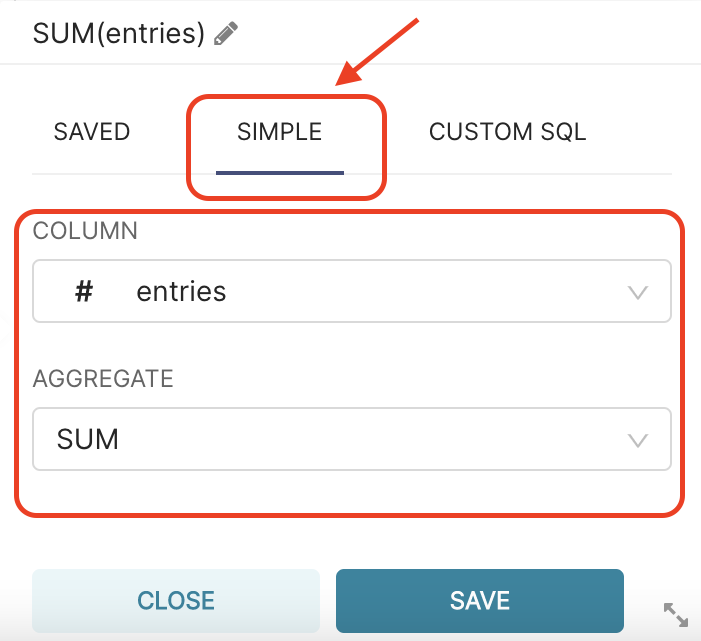{width="250px"}

::: side-note
Based on your definition, this metric is now labeled SUM(entries). Unless you edit it, this is the label that will appear in the legend of your chart.

To edit the label of this metric (e.g. change it to "Number of entries"), click on the pencil icon, highlighted below:

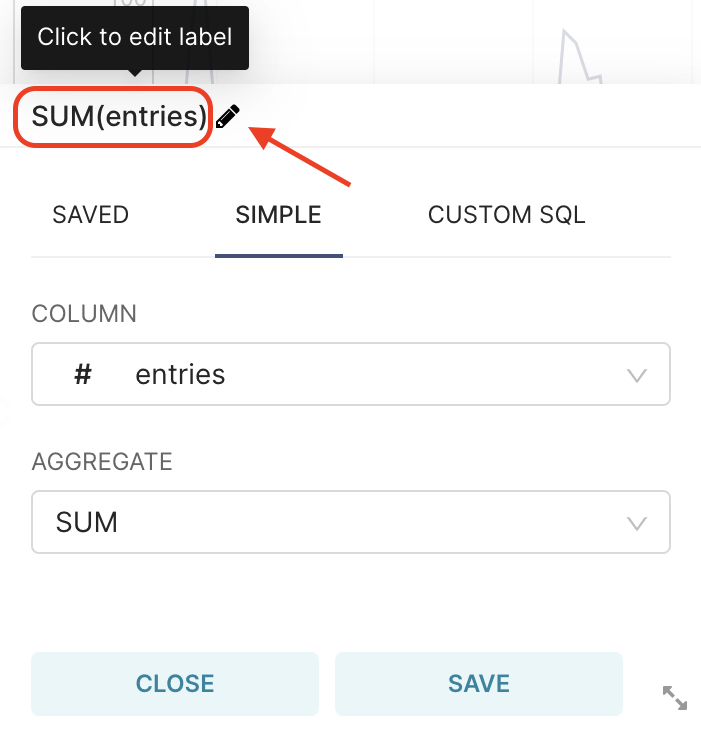{width="250px"}

:::

When you are done, click `SAVE` in this pop-up window, then click `RUN QUERY`on the right panel of the Chart page. The result should be the following:

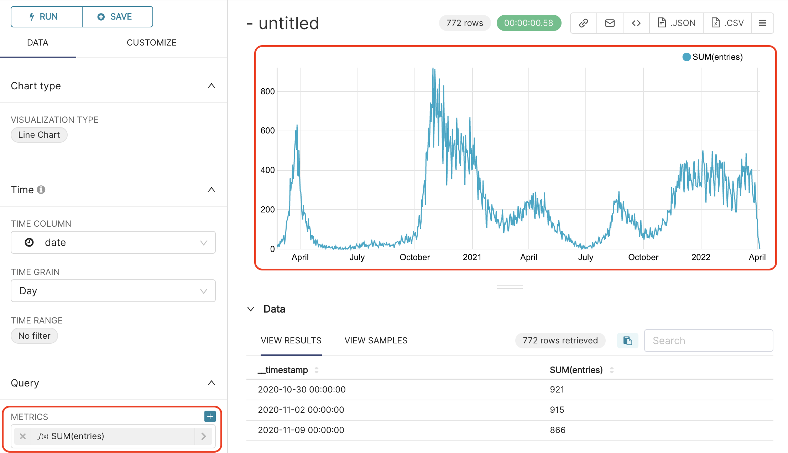{width="500px"}

### Time grain

By default the TIME GRAIN field in the Time section is set to `Day`. As we are interested by numbers of weekly hospitalisations, let's change it to `Week`, for aggregating entries at the weekly-level, and `RUN QUERY`again. You will get the result below, where you can directly see how it made the line smoother.

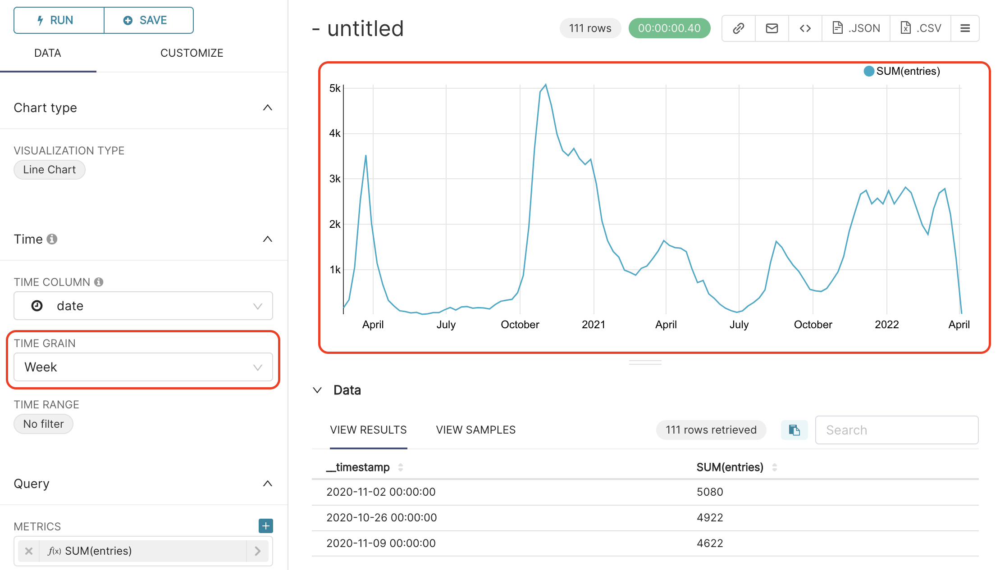{width="500px"}

### Group by Swiss Canton (State)

Currently all entries in our table (independently from `georegion` value) are summed by week. Let's GROUP `entries` BY `georegion`, to see the evolution of the number of entries by georegion (Swiss canton).

In **GROUP BY** field, add `georegion` column, and press on `RUN QUERY`.

The results should look like the following:

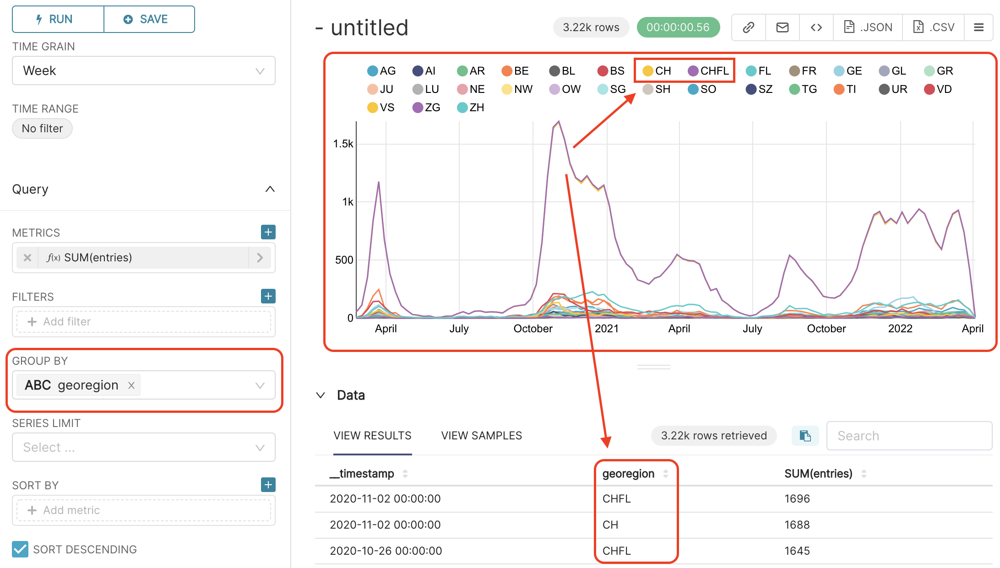{width="500px"}

**Great!** We can see now that data are separated by canton. But, we also see that we have data for the whole Switzerland (`georegion = CH`) and for Switzerland and Liechtenstein (`georegion = CHFL`) all together.

### Filters

In order to focus on canton data only, we must FILTER out `CH` and `CHFL` data. In FILTERS, click on `+Add filter`, and set the filter to `georegion NOT IN (CH, CHFL)`.

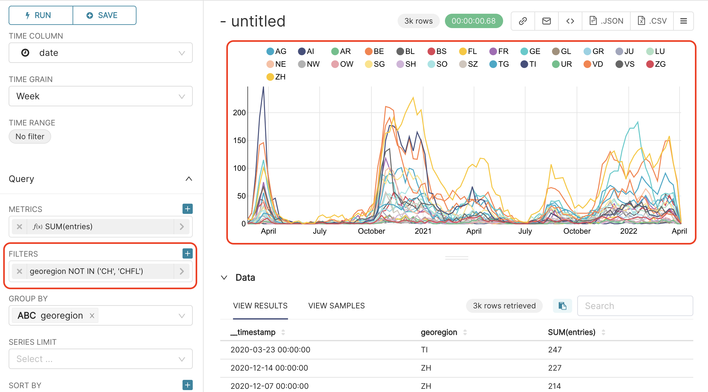{width="500px"}

### Finalise chart: Legend, Axes, Title

-   In case a **legend** was not added automatically, when you grouped by `georegion`, add it to see the correspondence between the line colors and the cantons. For that, go to the CUSTOMIZE tab (next to DATA tab), and tick the LEGEND box.

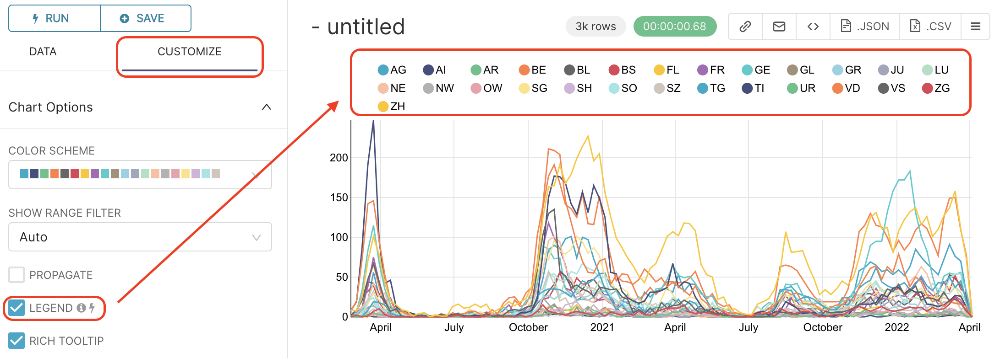{width="500px"}

Note that the plot is interactive; you can **show** or **hide** lines from the chart by **clicking** or **double-clicking** on their associated legend item!

-   While we are in the CUSTOMIZE tab, let's also add a name to the **X** and **Y axes**. In the X Axis section, write `Time` in the X AXIS LABEL field, and `Number of hospitalisations` in the Y AXIS LABEL field of the Y AXIS section.

And that's the result, where we can see the different waves during the last 2 years, by Swiss canton.

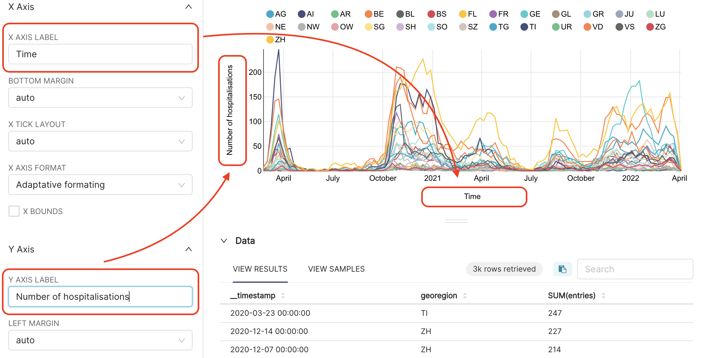{width="500px"}

Finally, let's give a **title** to this line chart, for example `Evolution of weekly COVID hospitalisations in Switzerland by Canton`.You can save it, by clicking on `+SAVE` button in the middle panel.
