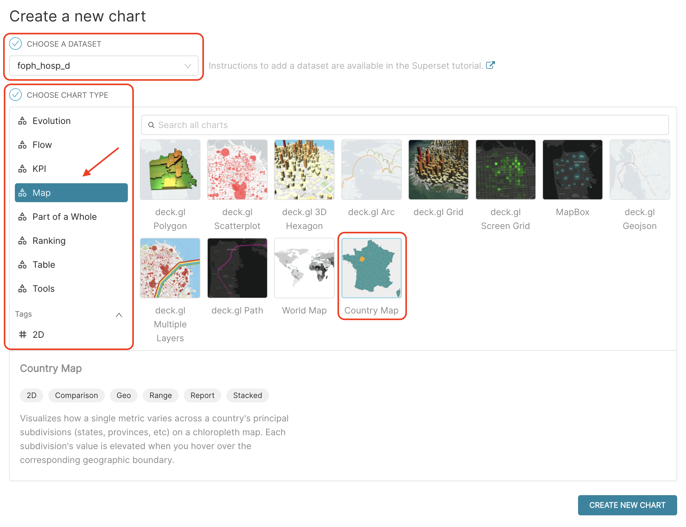
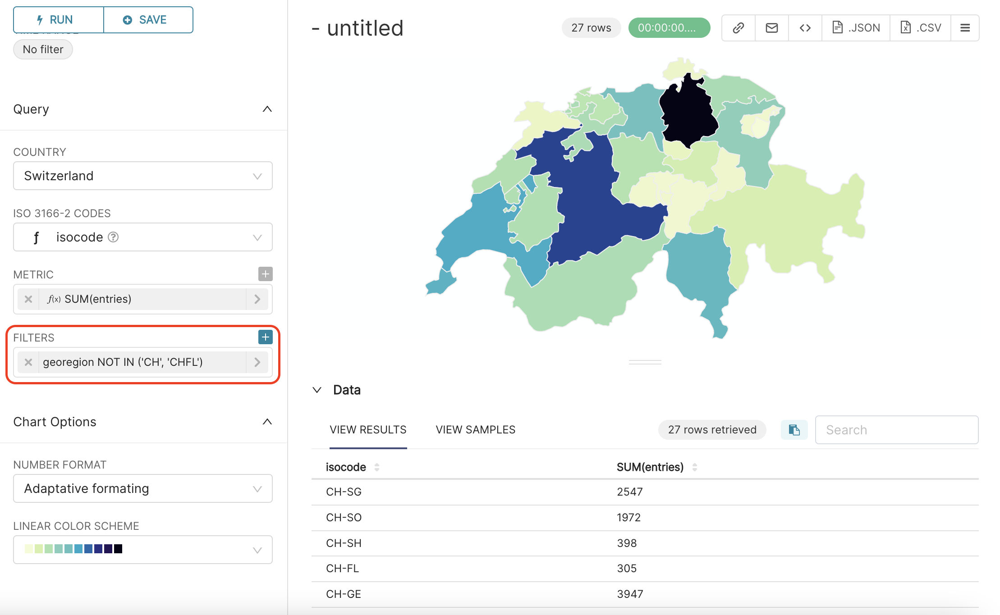
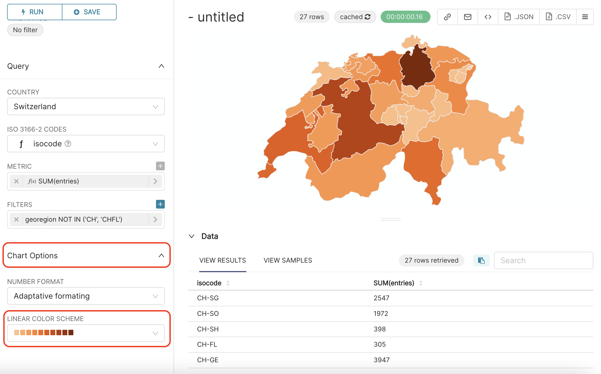
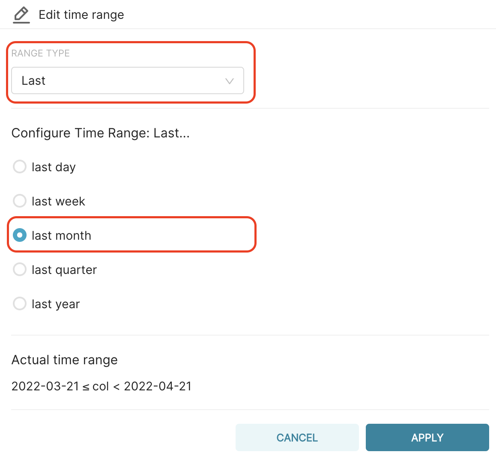
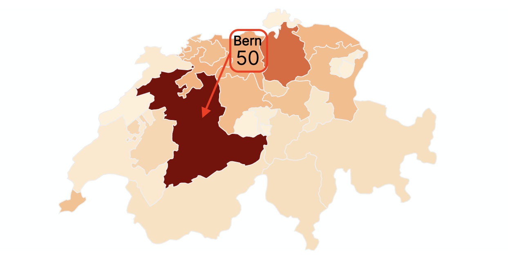

## Country map chart

Now, let's create a map chart:

1.  Go to the **Charts page**, and
2.  Click on the `+CHART` button.

Suppose we are interested in creating a **Map** providing an overview of **COVID hospitalisations across Switzerland's cantons during the last month**, so:

1.  In the field CHOOSE A DATASET, type `foph_hosp_d`.
2.  In the CHOOSE CHART section, go to the **Map Category**, and select the `Country Map` in the right panel.
3.  Then, click on the `CREATE NEW CHART` button

{width="750px"}

### Query

In the Query section of the Chart Page, fill :

1.  the COUNTRY field with `Switzerland`,
2.  the ISO 3166-2 CODES field with `isocode`, and
3.  the METRIC field with `SUM(entries)`, as we did in the previous line chart.

click on the `+` symbol next to METRIC, select the SIMPLE panel, and set COLUMN to `entries` and AGGREGATE to `SUM`.

It should look like the following:

{width="500px"}

In this dataset, the `isocode` column allows us to link the canton data to the corresponding canton polygon on the country map. This `isocode` is a **concatenation** of the string `'CH-'` with the value of `georegion` ('CH'+georegion). For instance, canton Geneva, with `georegion = 'GE'`, has and `isocode = 'CH-GE'`.

### Filter

As we are interested here by canton data only, let's again FILTER out data where `georegion = ‘CH’` or `georegion = ‘CHFL’`. To do that, we will add a filter `georegion NOT IN (‘CH’,’CHFL’)`, and `RUN QUERY` again, as follows:

{width="500px"}

### Color scheme

If you are not fan of the color scheme, you can change it, by going to the **Chart Options** section (under the **Query** section), selecting for instance `oranges` in the LINEAR COLOR SCHEME field, and `RUN QUERY` again, to get the following result:

{width="500px"}

It does look quite nice :) What do you think?

### Time range

As we did not edit the time-related elements yet, you have now on your map the total number of hospitalisation entries per canton, since February 2020, while we are interested by last month's hospitalisations only.

To correct that, we should go to **Time** section in the middle panel, and set TIME RANGE to `last month`. For that, click on `No filter` value in the TIME RANGE field; this will open a pop-up window named **Edit time range**.

There, select:

1.  `Last` in RANGE TYPE,
2.  select `last month` in **Configure Time Range Last...**:, and
3.  click on the `APPLY` button in the bottom right of the window. The window will close and you will be able to `RUN QUERY` again.

{width="500px"}

### Dynamic map

Below is the resulting map. Notice that the map is **dynamic**, when you pass your mouse over the cantons on the map, the **name** of the canton and the **number of hospitalisation entries** in this canton appear.

{width="500px"}

### Finalise chart

It is now time to :

1.  Specify a title for the chart, for instance `Number of COVID hospitalisations during last month`,
2.  Save it, by clicking on `+SAVE` button in the middle panel.
