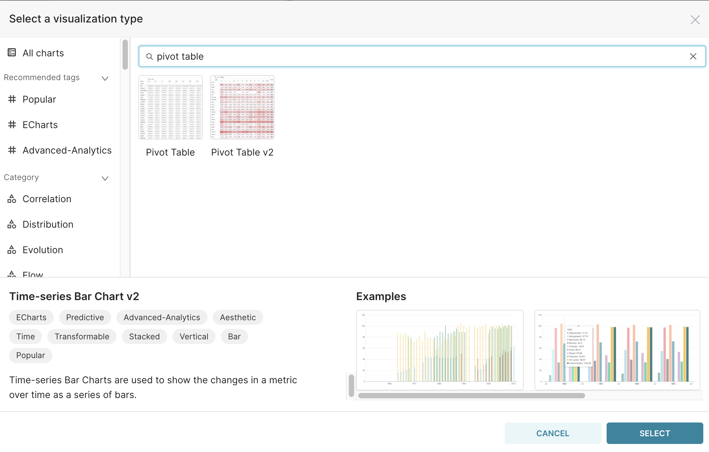
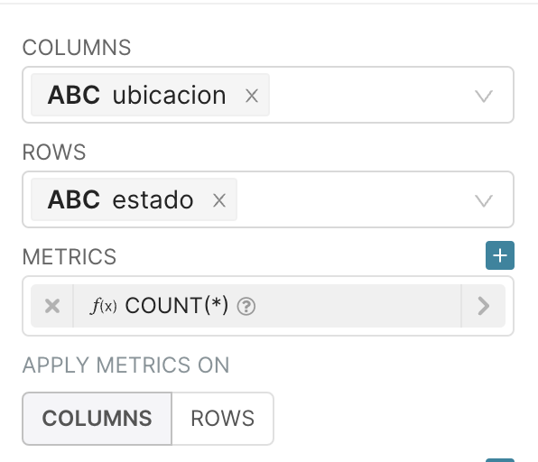
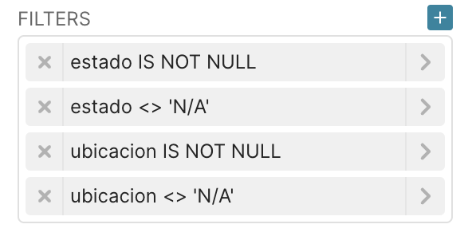
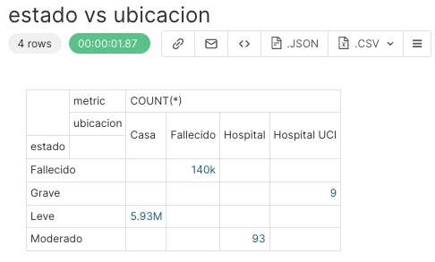
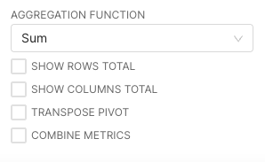
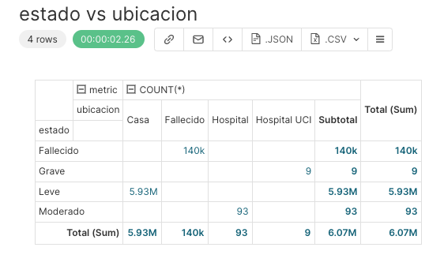

## Pivot table

A pivot table is a good visualisation to see the relation of discrete values in two different columns of a dataset. Using the `positive_cases_covid_d` dataset, let's see the total number of cases related to the values in the column `estado` that represent the severity of the COVID-19 case and the column `ubicacion` that represents where the covid-19 case was treated. 

Below is the meaning of the values that will appear in the visualisation:

* `Casa`:  It means that the individual was treated at home;
* `Fallecido`: It means that the individual died from covid-19; 
* `Leve`: It means that the individual had mild covid-19 symptoms; 
* `Moderado`: It means that the individual had moderate covid-19 symptoms; 
* `Grave`: It means that the individual had severe covid-19 symptoms. 

To do this, open the `positive_cases_covid_d` dataset and click on the `Table` value to change the VISUALISATION TYPE:

{width=300px}

In the window that will open, type `Pivot table`:

{width=750px}

Click on the `Pivot Table v2` and on the `SELECT` button. 

We need to select a column to be used as columns of the pivot table and another to be used as rows of the pivot table. In this example, let’s use `ubicacion` in the field COLUMNS and `estado` in the field ROWS. 

To see the number of cases grouped by the values in the columns and rows of the pivot table let’s use as metrics `COUNT(*)`, to count all the records returned in this aggregation. 

So, the final query is: 

{width=300px}

To avoid the columns with values not informed, let’s create 2 different filters. The first is to ignore the null values and the second is to ignore the values equal to “N/A” that represent the individuals that died but not by covid.  

{width=300px}

The `<>` represents the `not equals` operator. 

Then click on the `RUN` button, and the result will be: 

{width=500px}

In the `Options` section selected below you have the following possibilities: 

{width=300px}

If you select the first two items (`SHOW ROWS TOTAL`, and `SHOW COLUMNS TOTAL`), that is the result: 

{width=500px}

It is now time to :

1.  Specify a title for the chart, for instance `estado vs ubicacion`,
2.  Save it, by clicking on `+SAVE` button in the middle panel.

Furthermore, it's possible to change the aggregation function used to compute the total values in the rows in the columns by changing the value in the select box. The default value is `Sum`. 

It’s also possible to transpose the table, by selecting the `TRANSPOSE PIVOT` and put different metrics side by side (if you add more than one metric in the `METRICS` field) by selecting the `COMBINE METRICS`. 

