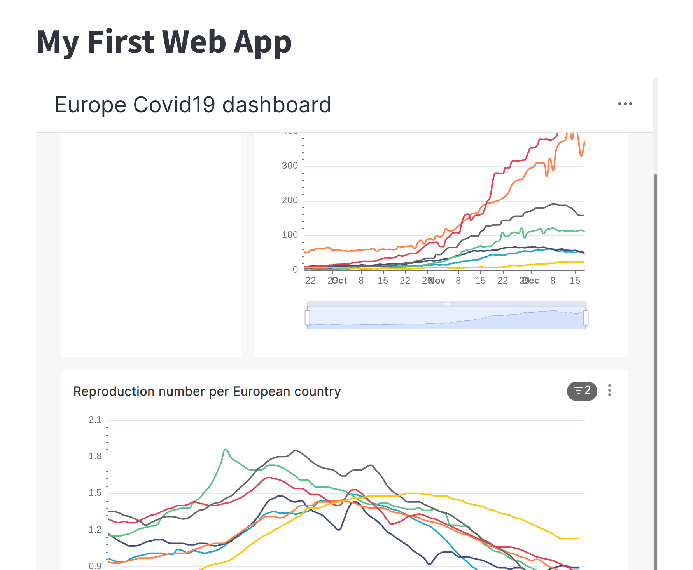

# Building Web-apps based on the Hub

It is possible and very easy to build simple web applications based of the EpiGraphHub.

The examples that will be explored in this tutorial are dashboard-like, but go one step further than the interactive dashboards that can be created using the standard web interface of EpiGraphHub. This extra step is the ability to run custom code in the background of you dashboard, beyond just simple figure manipulation. But we will still be able to take advantage of the interactive graphs and dashboards created and published through EpiGraphHub's web interface.

## Streamlit-based apps

We will start this tutorial building an app based on [Streamlit](https://streamlit.io), one of the fastest ways to build data apps available today. 

### Embedding a dashboard
Let's take A simple dashboard developed and published in EpiGraphHub. In order to embed it in a very simple Streamlit app: Would require these lines of code:

```python
import streamlit as st

"# My First Web App"

st.components.v1.iframe("https://epigraphhub.org/superset/dashboard/9/?standalone=true",
width=800, height=800, scrolling=True)
```

Once you write the lines of code above, save them as `myapp.py`. Then you can run it locally like this:

```bash
$ streamlit myapp.py
```
You will be able to see [your app](http://localhost:8501/) in the browser.



The simple command above allows you to test your app before you deploy it on the server. 

Streamlit allows for writing much more detailed application, and you should refer to its documentation for more information. But by using streamlit on top of EpiGraphHub, will allows you to easily connect to EpiGraphHub's databases, perform queries and create any visualizations you may want.


## Deploying your App
When your app is ready to deploy, Just push it to a github repository, and open an issue on the [EpiGraphHub repository](https://github.com/thegraphnetwork/EpiGraphHub/issues) descrcibing your app and why you want to deploy it on our server. Label the issue `App deploy request`.

One of our developers will respond to the issue queueing it for deployment. Once the app is deployed, Every time you push an update to the main branch of your app github repository, it will be automatically redeployed on our servers.


