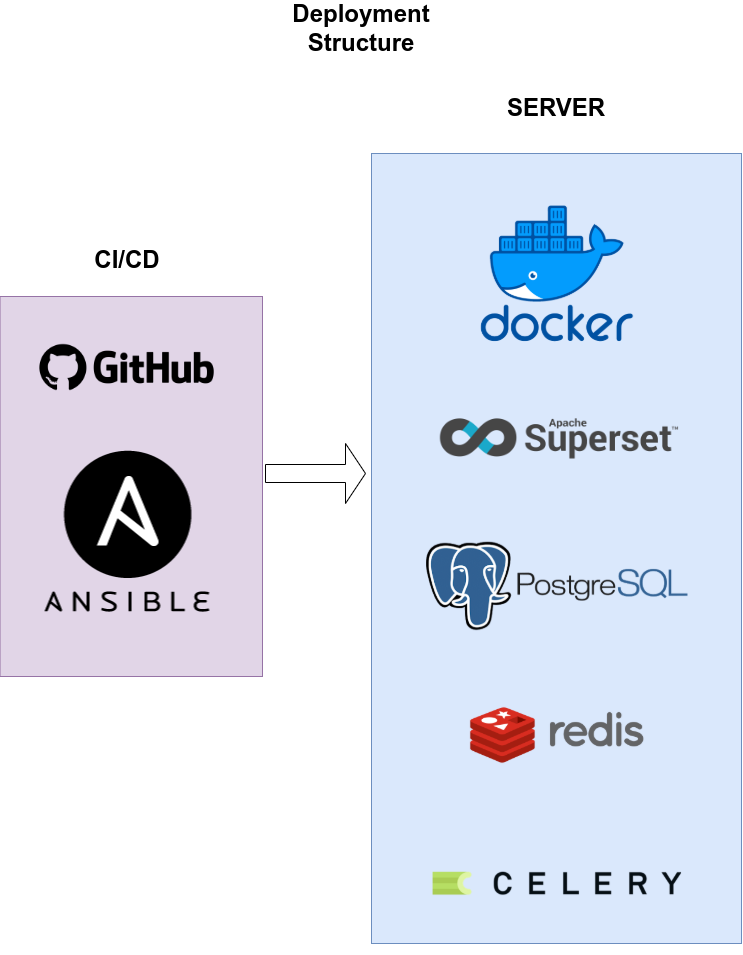

<!--
*** Template found on
*** https://github.com/othneildrew/Best-README-Template/blob/master/BLANK_README.md
*** To avoid retyping too much info. Do a search and replace for the following:
*** github_username, repo_name, twitter_handle, email, project_title, project_description
-->


<!-- PROJECT SHIELDS -->
<!--
*** I'm using markdown "reference style" links for readability.
*** Reference links are enclosed in brackets [ ] instead of parentheses ( ).
*** See the bottom of this document for the declaration of the reference variables
*** for contributors-url, forks-url, etc. This is an optional, concise syntax you may use.
*** https://www.markdownguide.org/basic-syntax/#reference-style-links
-->
[![Contributors][contributors-shield]][contributors-url]
[![Forks][forks-shield]][forks-url]
[![Stargazers][stars-shield]][stars-url]
[![Issues][issues-shield]][issues-url]
[![MIT License][license-shield]][license-url]
[![LinkedIn][linkedin-shield]][linkedin-url]


<!-- PROJECT LOGO -->
<br />
<p align="center">
  <a href="https://github.com/thegraphnetwork/EpiGraphHub">
    
  </a>

  <h3 align="center">EPIGRAPHHUB</h3>

  <p align="center">
    Health Data Hub & Data Analysis Ecosystem for Rapid Epidemic Outbreak Response
    <br />
    <a href="https://epigraphhub.readthedocs.io"><strong>Explore the docs »</strong></a>
    <br />
    <br />
    <a href="https://epigraphhub.org">View Platform</a>
    ·
    <a href="https://github.com/thegraphnetwork/GRAPHnetEpiApp/issues">Report Bug</a>
    ·
    <a href="https://github.com/thegraphnetwork/GRAPHnetEpiApp/issues">Request Feature</a>
  </p>
</p>


<!-- TABLE OF CONTENTS -->
<details open="open">
  <summary><h2 style="display: inline-block">Table of Contents</h2></summary>
  <ol>
    <li>
      <a href="#about-the-project">About The Project</a>
      <ul>
        <li><a href="#built-with">Built With</a></li>
      </ul>
    </li>
    <li>
      <a href="#getting-started">Getting Started</a>
      <ul>
        <li><a href="#prerequisites">Prerequisites</a></li>
        <li><a href="#installation">Installation</a></li>
      </ul>
    </li>
    <li><a href="#usage">Usage</a></li>
    <li><a href="#roadmap">Roadmap</a></li>
    <li><a href="#contributing">Contributing</a></li>
    <li><a href="#license">License</a></li>
    <li><a href="#contact">Contact</a></li>
    <li><a href="#acknowledgements">Acknowledgements</a></li>
  </ol>
</details>


<!-- ABOUT THE PROJECT -->
## About The Project

EpigraphHub is an entirely open source Data integration platform focused on Epidemiological analyses.
                                   


### Built With

EpigraphHub is built on top of the industry-leading opensource BI platform [Apache Superset](https://superset.apache.org) enriched by our own analytical libraries in Python and R.


<!-- GETTING STARTED -->
## Getting Started
To get a feel of EpigraphHub as a user, please check it out at **[Epigraphhub.org](https://epigraphhub.org)**.


### Prerequisites


### Installation


<!-- USAGE EXAMPLES -->
## Usage


<!-- ARCHITECURE -->


<!-- ROADMAP -->
## Roadmap

See the [open issues](https://github.com/thegraphnetwork/GRAPHnetEpiApp/issues) for a list of proposed features (and known issues).

Check our wiki for complementary informations


<!-- CONTRIBUTING -->
## Contributing

Contributions are what make the open source community such an amazing place to be learn, inspire, and create. Any contributions you make are **greatly appreciated**.
Contact us to get involved in the project and join our team on discord

1. Fork the Project
2. Create your Feature Branch (`git checkout -b feature/ProposedFeature`)
3. Commit your Changes (`git commit -m 'Add some ProposedFeature'`)
4. Push to the Branch (`git push origin feature/ProposedFeature`)
5. Open a Pull Request


<!-- LICENSE -->
## Development

To create a new environment for EpiGraphHub, you can use it using
conda or docker.

Also, ensure you have the `.env` file with the correct configuration.
You can copy its structure from `.env.tpl`.

### Conda

If you don't have **conda** installed, you can install it from
[here](https://github.com/mamba-org/mamba#micromamba). Micromamba
is a miniconda version with mamba, a powerful installer that is much
faster than the conda installer.

Create your new environtment running the following command:

```bash
$ mamba env create -n conda/prod.yaml
```

To activate your new environment with all the packages installed, run:

```bash
$ conda activate epigraphhub
```

### Docker
                                   

                              

The project provides three **docker-compose** files, where one is the base
definition (`docker/compose-base.yaml`) and the others are one for
development (`docker/compose-dev.yaml`) and other for production
(`docker/compose-prod.yaml`). Additionally, there is a **Makefile**
file that provides `make` targets that helps to manage the docker services:

- `docker-build`: builds docker images
- `docker-start`: starts docker services
- `docker-stop`: stops docker services
- `docker-restart`: restarts docker services
- `docker-logs`: shows docker
- `docker-dev-prepare-db`: prepares the development version of the database
- `docker-run-cron`: run the cron tasks
- `docker-bash`: opens the docker service bash

This `make` targets runs by default docker for development. For production,
it is necessary to pass the argument `ENV=prod` , for example:

```bash
make docker-build ENV=prod
```

A common workflow to prepare the system would be:

1. Build the docker image:

```bash
$ make docker-build
```

2. Start the services:

```bash
$ make docker-start
```

Before moving forward, check if the services are working properly:

```bash
$ ./docker/healthcheck.sh epigraphhub
```

3. Now, prepare the development database (skip it for production):

```bash
$ make docker-prepare-db
```

## Deployment

The deployment is executed by **Ansible** and triggered by **GitHub Actions**.
When a new release is triggered, on **GitHub Actions**, there is a step
there that uses **Ansible** to connect to the **EpiGraphHub** server
and deploy the new version.

NOTE: Currently, the deployment process is under development.

The deployment is designed in the following structure:



All the services are being migrated to docker containers. It will allows us
to isolate the services and keep the host server safer.

<!-- LICENSE -->
## License

Distributed under the MIT License. See `LICENSE` for more information.


<!-- CONTACT -->
## Contact

Project Link: [https://github.com/thegraphnetwork/GRAPHnetEpiApp](https://github.com/thegraphnetwork/GRAPHnetEpiApp)

Linked-in : https://www.linkedin.com/company/the-graph-network


<!-- ACKNOWLEDGEMENTS -->
## Acknowledgements

*TBD*


<!-- MARKDOWN LINKS & IMAGES -->
<!-- https://www.markdownguide.org/basic-syntax/#reference-style-links -->
[contributors-shield]: https://img.shields.io/github/contributors/thegraphnetwork/GRAPHnetEpiApp.svg?style=for-the-badge
[contributors-url]: https://github.com/thegraphnetwork/GRAPHnetEpiApp/graphs/contributors
[forks-shield]: https://img.shields.io/github/forks/thegraphnetwork/GRAPHnetEpiApp.svg?style=for-the-badge
[forks-url]: https://github.com/thegraphnetwork/GRAPHnetEpiApp/network/members
[stars-shield]: https://img.shields.io/github/stars/thegraphnetwork/GRAPHnetEpiApp.svg?style=for-the-badge
[stars-url]: https://github.com/thegraphnetwork/GRAPHnetEpiApp/stargazers
[issues-shield]: https://img.shields.io/github/issues/thegraphnetwork/GRAPHnetEpiApp.svg?style=for-the-badge
[issues-url]: https://github.com/thegraphnetwork/GRAPHnetEpiApp/issues
[license-shield]: https://img.shields.io/github/license/thegraphnetwork/GRAPHnetEpiApp.svg?style=for-the-badge
[license-url]: https://github.com/thegraphnetwork/GRAPHnetEpiApp/blob/master/LICENSE.txt
[linkedin-shield]: https://img.shields.io/badge/-LinkedIn-black.svg?style=for-the-badge&logo=linkedin&colorB=555
[linkedin-url]: https://www.linkedin.com/company/the-graph-network
