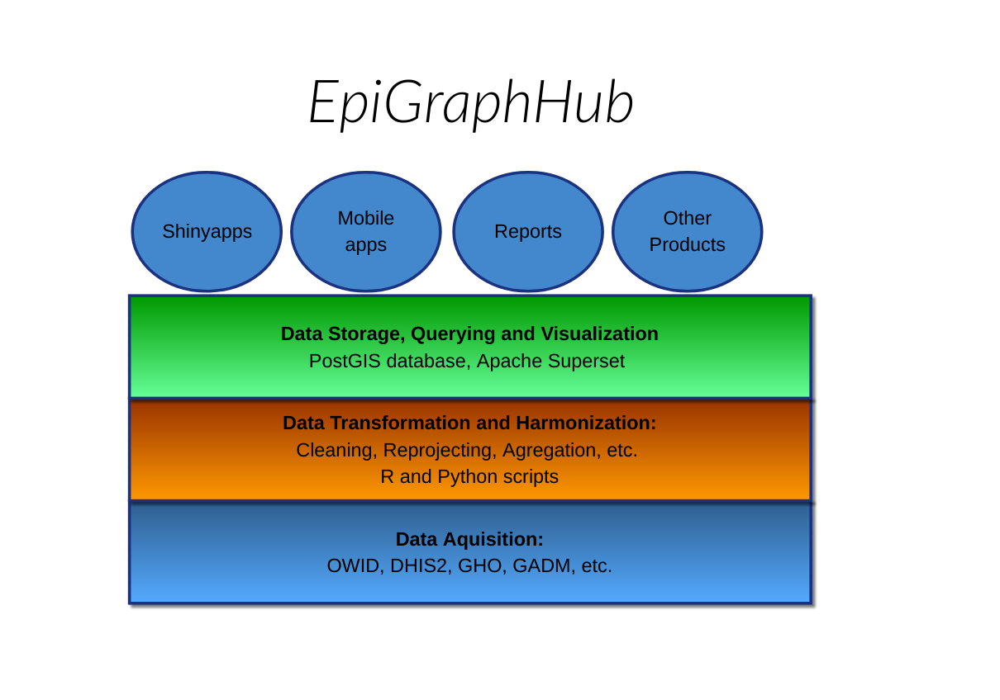

# EpiGraphHub
Software platform to Gather, transmform, harmonize and store epidemiological data for analytical purposes.

The Architecture depicted above is described in more detail below, from the bottom up.

## Data Acquisition
This layer forms the base of the Hub's architecture, and is responsible to collect open data to be used by the upper layers.

There a growing set of open health data sources currently available On the internet. Some of these sources are already available through well-designed APIs, but the Hub will develop and make available easy-to-use client libraries which will be used internally for the `Data Transformation and Harmonization` layer, but can also be used for other applications. Initial components:

1. [Our World in Data](https://ourworldindata.org) client: This project is also a data aggregator. Initially we will collect COVID-19 data from it. Our library will also facilitate storage according to the Hub internal data storage  standards.
2. [Global Health Observatory (GHO)](https://www.who.int/data/gho) client: GHO is a WHO maintained datasource. Our client is already available as a [Python library](https://github.com/thegraphnetwork/ghoclient) on [PYPI](https://pypi.org/project/ghoclient/).
3. [GADM](https://gadm.org/) client: GADM is a global set of standardized maps of all countries by administrative region. The Hub will maintain a local copy of their latest releases.
4. Others...

## Data transformation and Harmonization

## Data Storage, Querying and  Visualization

