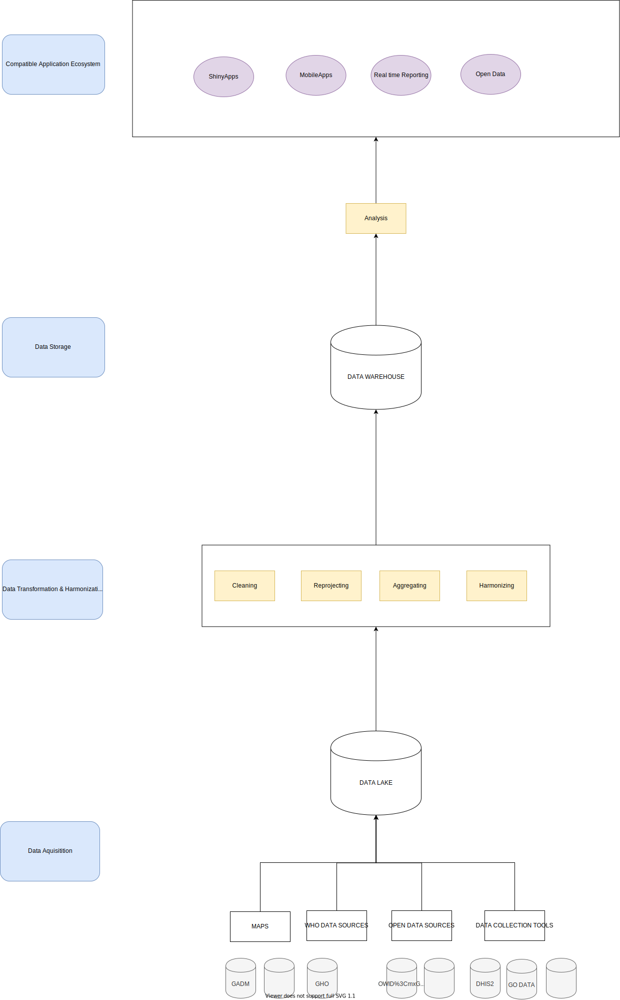

<!--
*** Template found on 
*** https://github.com/othneildrew/Best-README-Template/blob/master/BLANK_README.md
*** To avoid retyping too much info. Do a search and replace for the following:
*** github_username, repo_name, twitter_handle, email, project_title, project_description
-->

<!-- PROJECT SHIELDS -->
<!--
*** I'm using markdown "reference style" links for readability.
*** Reference links are enclosed in brackets [ ] instead of parentheses ( ).
*** See the bottom of this document for the declaration of the reference variables
*** for contributors-url, forks-url, etc. This is an optional, concise syntax you may use.
*** https://www.markdownguide.org/basic-syntax/#reference-style-links
-->
[![Contributors][contributors-shield]][contributors-url]
[![Forks][forks-shield]][forks-url]
[![Stargazers][stars-shield]][stars-url]
[![Issues][issues-shield]][issues-url]
[![MIT License][license-shield]][license-url]
[![LinkedIn][linkedin-shield]][linkedin-url]

<!-- PROJECT LOGO -->
 

  

  <h3 align="center">EPIGRAPHHUB</h3>

  

    Health Data Hub & Data Analysis Ecosystem for Rapid Epidemic Outbreak Response
     
    <a href="https://github.com/thegraphnetwork/GRAPHnetEpiApp"><strong>Explore the docs »</strong></a>
     
     
    <a href="https://github.com/thegraphnetwork/GRAPHnetEpiApp">View Demo</a>
    ·
    <a href="https://github.com/thegraphnetwork/GRAPHnetEpiApp/issues">Report Bug</a>
    ·
    <a href="https://github.com/thegraphnetwork/GRAPHnetEpiApp/issues">Request Feature</a>
  

<!-- TABLE OF CONTENTS -->

  
<h2 style="display: inline-block">Table of Contents</h2>

  <ol>
    <li>
      <a href="#about-the-project">About The Project</a>
      <ul>
        <li><a href="#built-with">Built With</a></li>
      </ul>
    </li>
    <li>
      <a href="#getting-started">Getting Started</a>
      <ul>
        <li><a href="#prerequisites">Prerequisites</a></li>
        <li><a href="#installation">Installation</a></li>
      </ul>
    </li>
    <li><a href="#usage">Usage</a></li>
    <li><a href="#roadmap">Roadmap</a></li>
    <li><a href="#contributing">Contributing</a></li>
    <li><a href="#license">License</a></li>
    <li><a href="#contact">Contact</a></li>
    <li><a href="#acknowledgements">Acknowledgements</a></li>
  </ol>

<!-- ABOUT THE PROJECT -->
## About The Project

### Built With

<!-- GETTING STARTED -->
## Getting Started

To get a local copy up and running follow these simple steps.

### Prerequisites

### Installation

<!-- USAGE EXAMPLES -->
## Usage

Use this space to show useful examples of how a project can be used. Additional screenshots, code examples and demos work well in this space. You may also link to more resources.

See Sphynx demo
<!-- ARCHITECURE -->

<!-- ROADMAP -->
## Roadmap

See the [open issues](https://github.com/thegraphnetwork/GRAPHnetEpiApp/issues) for a list of proposed features (and known issues).

Check our wiki for complementary informations

<!-- CONTRIBUTING -->
## Contributing

Contributions are what make the open source community such an amazing place to be learn, inspire, and create. Any contributions you make are **greatly appreciated**.
Contact us to get involved in the project and join our team on discord

1. Fork the Project
2. Create your Feature Branch (`git checkout -b feature/ProposedFeature`)
3. Commit your Changes (`git commit -m 'Add some ProposedFeature'`)
4. Push to the Branch (`git push origin feature/ProposedFeature`)
5. Open a Pull Request

<!-- LICENSE -->
## License

Distributed under the MIT License. See `LICENSE` for more information.

<!-- CONTACT -->
## Contact

Project Link: [https://github.com/thegraphnetwork/GRAPHnetEpiApp](https://github.com/thegraphnetwork/GRAPHnetEpiApp)

Linked-in : https://www.linkedin.com/company/the-graph-network

<!-- ACKNOWLEDGEMENTS -->
## Acknowledgements

* 
* 
* 

<!-- MARKDOWN LINKS & IMAGES -->
<!-- https://www.markdownguide.org/basic-syntax/#reference-style-links -->
[contributors-shield]: https://img.shields.io/github/contributors/thegraphnetwork/GRAPHnetEpiApp.svg?style=for-the-badge
[contributors-url]: https://github.com/thegraphnetwork/GRAPHnetEpiApp/graphs/contributors
[forks-shield]: https://img.shields.io/github/forks/thegraphnetwork/GRAPHnetEpiApp.svg?style=for-the-badge
[forks-url]: https://github.com/thegraphnetwork/GRAPHnetEpiApp/network/members
[stars-shield]: https://img.shields.io/github/stars/thegraphnetwork/GRAPHnetEpiApp.svg?style=for-the-badge
[stars-url]: https://github.com/thegraphnetwork/GRAPHnetEpiApp/stargazers
[issues-shield]: https://img.shields.io/github/issues/thegraphnetwork/GRAPHnetEpiApp.svg?style=for-the-badge
[issues-url]: https://github.com/thegraphnetwork/GRAPHnetEpiApp/issues
[license-shield]: https://img.shields.io/github/license/thegraphnetwork/GRAPHnetEpiApp.svg?style=for-the-badge
[license-url]: https://github.com/thegraphnetwork/GRAPHnetEpiApp/blob/master/LICENSE.txt
[linkedin-shield]: https://img.shields.io/badge/-LinkedIn-black.svg?style=for-the-badge&logo=linkedin&colorB=555
[linkedin-url]: https://www.linkedin.com/company/the-graph-network
